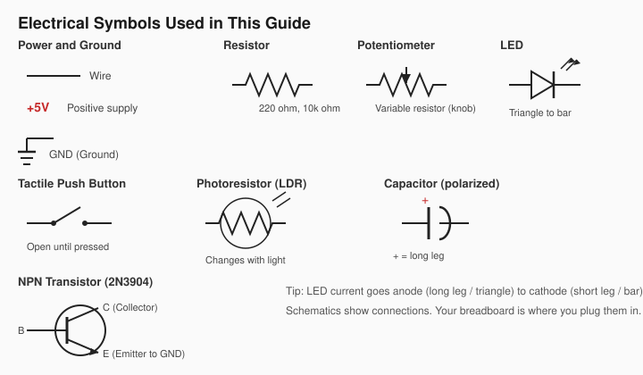
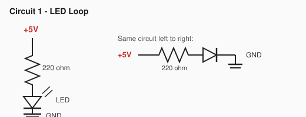
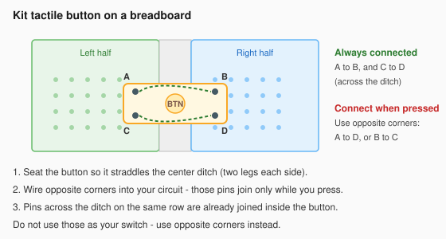
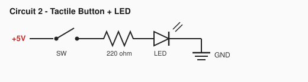
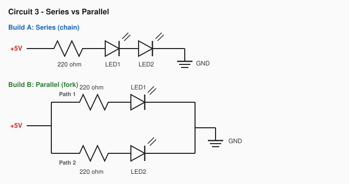
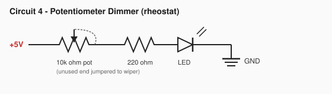
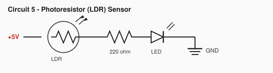
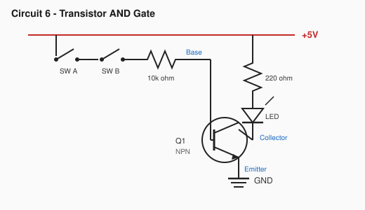
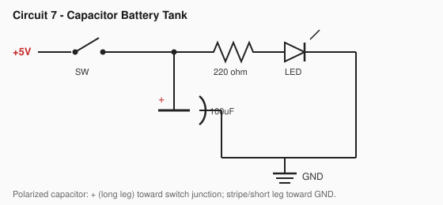
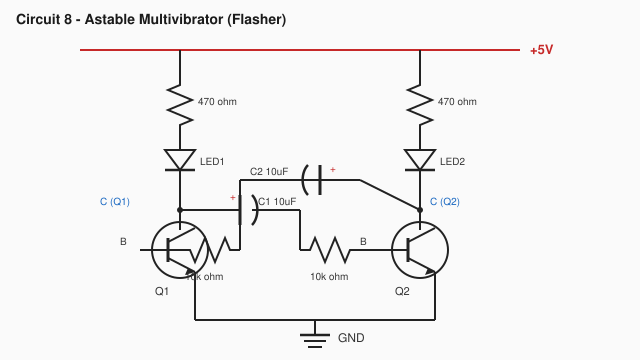

# Beginner Circuits

Welcome to the hardware lab! Whether you already code in Scratch, build with LEGO Spike
Prime, or are just getting started with electronics, this guide helps you learn circuits
and components — the foundation for programming real embedded projects.

**Path so far:** If you are following the course in order, you may already know
[Scratch](../01-scratch/scratch-programming.md). The same ideas — loops, “when something
happens,” and and/or logic — show up here as wires and parts. After these missions,
continue to the [micro:bit V2 guide](../04-microbit/microbit-v2.md).

In coding, you build with blocks or text. Here, you are going to build with electrons.
This guide has **Mission 0 (safety)** plus **8 circuit missions**. For each circuit, you
will wire the parts, run an experiment, and observe what happens to discover the hidden
rules of electronics.

You’re ready for the full sequence — including transistors, logic, and an oscillator —
so treat every circuit as a real mission, not a demo.

Blueprints in this guide use **real electrical schematic symbols**. Learn them once in
Mission 0, then read every circuit like a pro.

______________________________________________________________________

## What you need

### Power (needed with either option)

Starter kits do **not** usually include a battery. Also get:

| Part               | Quantity | Notes                                                                         |
| ------------------ | -------- | ----------------------------------------------------------------------------- |
| 9V battery         | 1        | Alkaline is fine                                                              |
| 9V battery adapter | 1        | Snap connector to **DC barrel jack** (fits the kit’s breadboard power module) |

Plug the adapter into the power module’s barrel jack, set the module to **5V**, then use
the module’s rails for `+5V` and `GND`. Unplug or switch the module off before changing
wires.

### Option A: Electronic Starter Kit (easiest)

**Electronic Starter Kit** — a collection of essential parts like resistors, LEDs, and
jumper wires.

- [Amazon option 1](https://www.amazon.com/gp/product/B099MQV8ZW) or
  [Amazon option 2](https://www.amazon.com/gp/product/B073ZC68QG/ref=ox_sc_saved_title_1?smid=AX8SR0V05IQ2E&psc=1)

These kits usually include a breadboard, 5V power module, jumper wires, LEDs, resistors,
buttons, a potentiometer, a photoresistor, capacitors, and NPN transistors.

**Kit notes for this guide**

- Many kits ship **2N2222** transistors instead of **2N3904**. For these missions,
  2N2222 is a fine substitute.
- Circuit 8 asks for **470Ω** LED resistors. If your kit has **330Ω** instead (common),
  use those — the flasher still works.

### Option B: Buy parts individually

If you prefer to shop à la carte, get at least this set (covers Circuits 1–8 with a
little spare), **plus** the 9V battery and adapter above:

| Part                                   | Quantity | Notes                                         |
| -------------------------------------- | -------- | --------------------------------------------- |
| Solderless breadboard (830 tie-points) | 1        | Half-size boards also work                    |
| 5V breadboard power supply module      | 1        | Barrel jack for the 9V adapter (USB optional) |
| Male-to-male jumper wires              | 1 pack   | Assorted lengths help                         |
| LEDs (5 mm)                            | 4+       | Red is fine; mix colors if you like           |
| 220Ω resistors                         | 4+       | LED bodyguards for most circuits              |
| 470Ω resistors                         | 2        | Circuit 8 LED protectors (330Ω OK if needed)  |
| 10kΩ resistors                         | 3+       | Transistor base resistors                     |
| Push buttons (breadboard tactile)      | 2        | 4-pin style that fits a breadboard            |
| 10kΩ potentiometer                     | 1        | Panel or trimmer with 3 pins                  |
| Photoresistor (LDR)                    | 1        | Light sensor                                  |
| 2N3904 NPN transistors                 | 2        | Or 2N2222                                     |
| 100µF electrolytic capacitor           | 1        | Polarized — watch + / −                       |
| 10µF electrolytic capacitors           | 2        | Polarized — watch + / −                       |

______________________________________________________________________

## Mission 0: The Maker Rules

Before you plug in a single wire, remember these rules:

1. **Power Off First:** Always unplug your battery module before changing wires.
2. **The Rule of the Long Leg:** LEDs and capacitors have a direction. Electricity only
   flows through them one way. The **long leg** always points toward the Positive (+)
   side. For capacitors with a stripe: **long leg = +**, **stripe / short leg = −
   (GND)**.
3. **Resistors are Bodyguards:** An LED connected directly to 5V power will POP and burn
   out instantly! Always protect your LED by putting a **220Ω** resistor in its path.
4. **Never connect + straight to −:** That makes a short circuit. No “spark tests.”
5. **Stuck? Ask before flipping forever:** If an LED will not light, check the
   troubleshooting list below. Flip the LED once if needed — then ask for help.

### Quick vocabulary

| Word           | Meaning                                                  |
| -------------- | -------------------------------------------------------- |
| **Circuit**    | A complete loop so electricity can travel out and back   |
| **GND (−)**    | Ground — the return path for current                     |
| **Resistor**   | Limits current (protects LEDs and transistor bases)      |
| **Series**     | Parts in one chain; same current, shared voltage         |
| **Parallel**   | Separate paths from the same power rails                 |
| **Transistor** | An electronic switch controlled by a small base signal   |
| **Capacitor**  | Stores and releases charge over time                     |
| **Schematic**  | A drawing of a circuit using standard electrical symbols |

### Mission 0.5: Learn the Electrical Symbols

Engineers don’t draw photos of every part — they draw **symbols**. Once you know these,
you can read almost any beginner circuit diagram.

**How to read a schematic**

1. Find **+5V** (top / start of the path) and **GND** (bottom / end of the path).
2. Follow the wires — a line means a connection.
3. Match each symbol to a real part on your breadboard.
4. Check direction for LEDs and polarized capacitors (arrow / + mark).

| Symbol means…                       | On your breadboard…                    |
| ----------------------------------- | -------------------------------------- |
| Zigzag resistor                     | Colored bands resistor                 |
| LED triangle + bar                  | LED (long leg = anode / triangle side) |
| Switch gap                          | Tactile push button (4-pin kit button) |
| Pot with arrow                      | Knob (potentiometer)                   |
| Resistor in a circle + light arrows | Photoresistor (LDR)                    |
| Capacitor with +                    | Electrolytic capacitor                 |
| Circle with C/B/E                   | Transistor (2N3904)                    |

### Mission 0.6: Breadboard Basics

A breadboard is a plastic board full of holes that connect inside — like LEGO for wires.

- **Middle area:** Each short row of 5 holes (a–e, and f–j) is connected **side to
  side**. Parts in the same row touch electrically.
- **Power rails:** The long strips on the sides (often marked **+** and **−**) run the
  length of the board. Put **+5V** on the red/+ rail and **GND** on the blue/− rail.
- **Tip:** Leave a gap (the center ditch) between the left and right halves — they do
  **not** connect across that ditch.
- **Schematic ↔ breadboard:** The schematic shows *what connects to what*. The
  breadboard is *where* you plug those connections.

______________________________________________________________________

## If it doesn’t work (Troubleshoot)

Check these in order:

1. Is power plugged in and turned on?
2. Is there a complete loop from +5V back to GND?
3. Is the LED the right way around (long leg toward + / anode toward higher voltage)?
4. Is there a 220Ω resistor protecting the LED?
5. Are wires in the same breadboard row when they should touch?
6. For a tactile push button: does it **straddle the center ditch**, and are you using
   **opposite corners**? (Those pins connect only when pressed.)

______________________________________________________________________

## Phase 1: The Basics of Flow

In Scratch, code runs in a loop. In electronics, electricity must complete a continuous
circle (a circuit) from the Positive (+) power to the Negative (−) Ground.

### Circuit 1: The Circle of Power (The Loop)

**The Goal:** Make an LED light up and learn how a circuit breaks.

**Parts Needed:** 5V Power, 1x 220Ω Resistor, 1x Red LED.

**Schematic:**

**Symbols in this circuit:** `+5V` · resistor · LED · `GND`

#### The Discovery (Observation)

**Experiment:** Once the light is on, pull one end of the resistor out of the
breadboard.

**What happened?** The light turns off instantly.

**The Concept:** Electricity is like a train on a track. If there is a gap anywhere in
the track, the train stops completely!

**You built it!** You learned: a circuit must be a closed loop.

______________________________________________________________________

### Circuit 2: Press for Action (Tactile Push Button)

**The Goal:** Use the **4-pin tactile push button** from your starter kit to control an
LED — the hardware version of `when space key pressed` in Scratch.

**Parts Needed:** 5V Power, 1x tactile push button (from the kit), 1x 220Ω Resistor, 1x
Red LED.

Starter kits usually include several of these little square buttons with four bent legs.
They click when pressed and spring back when you let go.

**How to seat the kit button**

1. Push the button into the breadboard so it **straddles the center ditch** — two legs
   on the left half, two on the right.
2. Wire **opposite corners** into the circuit (for example top-left and bottom-right).
   Those pins connect **only while pressed**.
3. Pins across the ditch on the **same row** are already joined inside the button. That
   is normal — do not use those as your “switch.”

**Schematic:**

**Symbols in this circuit:** `+5V` · switch (tactile button) · resistor · LED · `GND`

#### The Discovery (Observation)

**Experiment:** Press the button. The LED lights up immediately. Let go, and it turns
off.

**What happened?** Light on only while your finger is down — just like holding a key in
Scratch.

**Challenge:** Move one wire to the *same row across the ditch* instead of an opposite
corner. What happens? (The LED may stay on even when you are not pressing — those pins
are already joined inside the button.)

**The Concept:** The tactile button is a mechanical drawbridge. When you press it, the
bridge lowers, completing the “track” from Circuit 1 so the electrons can flow. When you
let go, the spring opens the gap again.

**You built it!** You learned: a tactile switch can open or close a circuit.

______________________________________________________________________

### Circuit 3: Chain vs. Path (Series and Parallel)

**The Goal:** See what happens when components have to share power.

**Parts Needed:** 5V Power, 2x LEDs, 2x 220Ω Resistors.

**Schematic:**

**Symbols in this circuit:** two ways to connect the same parts — **series** (one path)
vs **parallel** (forked paths)

#### The Discovery (Observation)

**Experiment:** Compare the brightness of the LEDs in Build A vs Build B.

**What happened?** In the Series chain, the lights are very dim (or may barely glow). In
the Parallel fork, both are bright.

**The Concept:** In a Series chain, the LEDs have to share the 5V from the battery
(roughly half each). In a Parallel fork, they each get their own path to the full 5V.

**Challenge:** What happens if you try 3 LEDs in series?

**You built it!** You learned: series shares; parallel keeps each path strong.

______________________________________________________________________

## Phase 2: Sensors and Adjustments

### Circuit 4: The Dimmer Knob (Potentiometer)

**The Goal:** Control the flow of electricity smoothly, like a slider variable in
Scratch.

**Parts Needed:** 5V Power, 1x 10kΩ Potentiometer (knob), 1x 220Ω resistor, 1x LED.

**Potentiometer tip:** A pot has **3 pins**. Looking at the pins from the front (knob
facing you), they are usually **Left — Middle (wiper) — Right**. For this dimmer, we use
the pot as a **variable resistor** (rheostat): wire **one outer pin** and the **middle
pin** into the circuit. Connect the unused outer pin to the middle pin with a short
jumper (recommended), or leave it empty.

**Schematic:**

**Symbols in this circuit:** potentiometer (zigzag + arrow) · resistor · LED

*(If turning the knob the “wrong way” makes it brighter when you expected dimmer, move
the +5V wire to the other outer pin instead.)*

#### The Discovery (Observation)

**Experiment:** Slowly turn the potentiometer knob back and forth.

**What happened?** The LED smoothly transitions from very bright to completely off.

**The Concept:** A potentiometer is a variable resistor. Turning the knob is like
**pinching a hose** — the more you pinch, the less water (electricity) gets through, so
the light gets dimmer!

**You built it!** You learned: resistance can change, and that changes brightness.

______________________________________________________________________

### Circuit 5: The Sunrise Sensor (Photoresistor)

**The Goal:** Make a circuit that reacts to its environment.

**LEGO Analogy:** This is the same kind of idea as the light sensor in your Spike Prime
kit!

**Parts Needed:** 5V Power, 1x Photoresistor (LDR), 1x 220Ω resistor, 1x LED.

**Schematic:**

**Symbols in this circuit:** LDR (resistor in a circle with light arrows) · resistor ·
LED

#### The Discovery (Observation)

**Experiment:** Cover the photoresistor tightly with your thumb to block the room light.

**What happened?** The LED gets dimmer or turns off when it gets dark.

**The Concept:** The photoresistor changes its resistance based on light. More light =
lower resistance (brighter LED). No light = huge resistance (dim/off LED).

**You built it!** You learned: a sensor can change a circuit without a button.

______________________________________________________________________

## Phase 3: Hardware Magic (Logic & Timers)

### Circuit 6: Hardware Logic (The AND Gate)

**The Goal:** Build the Scratch idea of `if <A> and <B>` using physical hardware.

**Pro tip:** Power off, wire carefully, then power on. The 10kΩ base resistor protects
the transistor — don’t skip it.

**Parts Needed:** 5V Power, 1x 2N3904 NPN Transistor, 2x Push Buttons, 1x 10kΩ Resistor
(base), 1x 220Ω Resistor (LED), 1x LED.

**Transistor tip:** Hold the flat face toward you. Pins left → right are usually
**Emitter, Base, Collector** (check your transistor’s datasheet/label if unsure).
Emitter goes to GND.

**Schematic:**

**Symbols in this circuit:** two switches · 10kΩ · NPN transistor · 220Ω · LED

#### The Discovery (Observation)

**Experiment:** Press only Switch A. Then press only Switch B. Finally, press both
switches at the same time.

**What happened?** The LED only lights up when BOTH are pressed.

**The Concept:** The transistor is an electronic switch. A small signal at the middle
pin (the Base) lets a bigger current flow from Collector to Emitter. Both buttons must
be pressed to deliver that Base signal — just like Scratch `and`.

**You built it!** You learned: hardware can do logic without writing code.

______________________________________________________________________

### Circuit 7: The Battery Tank (Capacitor)

**The Goal:** Store electricity to keep the light on even after the switch is released.

**Parts Needed:** 5V Power, 1x Push Button, 1x 100µF Capacitor, 1x 220Ω Resistor, 1x
LED.

**Schematic:**

**Symbols in this circuit:** switch · polarized capacitor · resistor · LED

> After you finish, unplug power. Capacitors can hold a little charge for a moment —
> that’s why the LED fades!

#### The Discovery (Observation)

**Experiment:** Hold the button down for 3 seconds. Then let go.

**What happened?** Instead of turning off instantly, the LED fades out slowly!

**The Concept:** A capacitor is like a water tower. While the button is pressed, it
fills up with electricity. When you let go of the button, the capacitor empties its
stored electricity into the LED, keeping it alive for a few extra seconds.

**You built it!** You learned: capacitors store and release energy.

______________________________________________________________________

### Circuit 8: The Flasher (Oscillators)

**The Goal:** Create an automatic timer loop without writing any code!

This is the most careful breadboard build in the guide — work slowly, follow the
checklist, and double-check polarity on both capacitors.

**Parts Needed:**

- 5V Power
- 2x 2N3904 NPN Transistors (Q1, Q2)
- 2x 10µF Capacitors (C1, C2) — watch polarity: + toward the transistor collectors
- 2x LEDs
- 2x 470Ω Resistors (R_LED — LED protectors)
- 2x 10kΩ Resistors (R_B — base resistors)

**Schematic:**

**Symbols in this circuit:** two NPN transistors · two polarized capacitors · four
resistors · two LEDs

**Build checklist (same as the schematic):**

1. Both emitters → GND.
2. Each collector → its own LED → 470Ω → +5V.
3. C1 from Q1 collector toward Q2 base (through 10kΩ at the base).
4. C2 from Q2 collector toward Q1 base (through 10kΩ at the base).
5. Capacitor **+** toward the collector side; stripe toward the base side.

#### The Discovery (Observation)

**Experiment:** Wire this up carefully. You do not need to press any buttons. Just
connect power and watch.

**What happened?** The LEDs flash back and forth automatically!

**The Concept:** The two capacitors take turns filling up and dumping out. When one
dumps, it turns off its transistor and turns on the other. This creates a repeating
pulse — a simple version of how electronic circuits can make a steady “tick-tock” rhythm
(real computers use more precise clocks, but the idea of a repeating pulse starts
here!).

**You built it!** You learned: circuits can create loops in hardware, not only in code.

______________________________________________________________________

## What’s next

You can now read a schematic, protect an LED, use a switch and sensors, and build simple
logic and timing in hardware.

1. Continue to the [Guide to micro:bit V2](../04-microbit/microbit-v2.md) to connect
   coding blocks (MakeCode) to a real board with sensors and outputs.
2. After micro:bit, come back for [Intermediate Circuits](intermediate.md) (same
   Circuits module) before Arduino — motors, diodes, and stronger switching.
3. Revisit [Learning Scratch Programming](../01-scratch/scratch-programming.md) anytime
   you want more practice with the same logic ideas in software.
4. Came from SPIKE? You already moved motors and sensors in a closed kit — here you wire
   the parts yourself.
