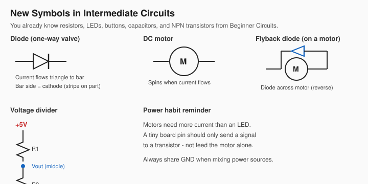
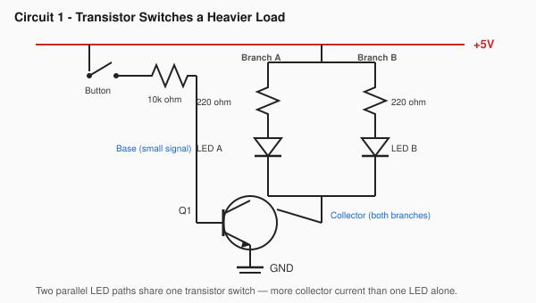
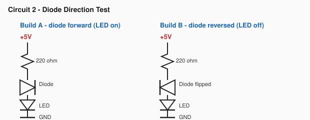
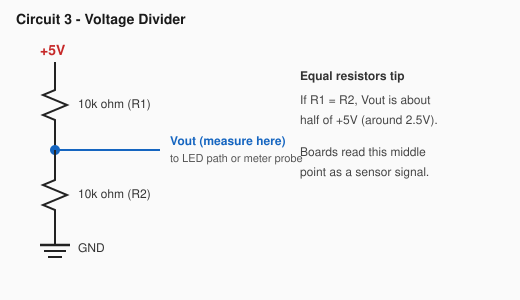
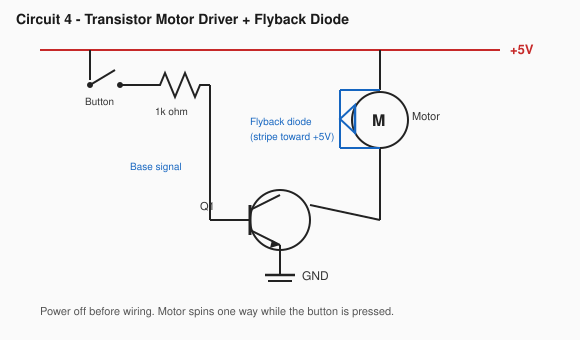
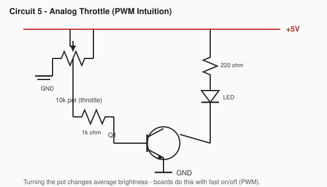

# Intermediate Circuits

This is the **Intermediate** section of the Circuits module (after
[Beginner Circuits](beginner.md)).

**Prerequisites:** Finish Beginner Circuits. Completing the
[micro:bit V2 guide](../04-microbit/microbit-v2.md) first is strongly suggested so you
already know why boards need sensors, switches, and stronger outputs.

**Goal:** Level up breadboard skills you will need before Arduino — transistors that
drive real loads, diodes, voltage dividers, a small DC motor with a flyback diode, and
the intuition behind PWM speed control.

This section has **Mission 0 (safety + new symbols)** plus **5 circuit missions**. Same
lab style as Beginner: wire it, observe it, name the idea.

______________________________________________________________________

## What you need

Reuse your Beginner Circuits kit (breadboard, 5V module, 9V battery + adapter, jumpers,
LEDs, resistors, buttons, potentiometer, NPN transistors). Add:

| Part                                       | Quantity | Notes                                   |
| ------------------------------------------ | -------- | --------------------------------------- |
| Silicon diode (1N4001 / 1N4007 or similar) | 2+       | Stripe = cathode                        |
| Small DC hobby motor (3–6V)                | 1        | Toy / STEM motor is fine                |
| 1kΩ resistors                              | 2+       | Stronger base resistors for motor drive |
| Multimeter (optional but helpful)          | 1        | For the voltage-divider mission         |

**Power habits for motors**

- Keep the 5V breadboard module for these labs if the motor is tiny and spins freely.
- If the motor stalls, brown-outs the board, or gets hot: stop. Use a separate 3–4×AA
  pack for the motor later, and **tie all GNDs together**.
- Never drive a motor by plugging it straight into a micro:bit or Arduino pin.

______________________________________________________________________

## Mission 0: Intermediate Maker Rules

Everything from Beginner Mission 0 still applies. Add these:

1. **Motors kick back:** When a motor stops, it can spit a voltage spike. A **flyback
   diode** gives that spike a safe path. Do not skip it.
2. **Signal vs power:** A button or board pin should control a transistor. The
   transistor (and the power rails) should feed the motor or heavy LEDs.
3. **Common ground:** If you ever use two power sources, their GND wires must meet.
4. **Power off before rewiring** — especially around motors and diodes.

### New symbols

______________________________________________________________________

## Phase 1: Stronger Switching

### Circuit 1: One Finger, Two LEDs (Transistor Load)

**The Goal:** See that a small base signal can switch a bigger collector path — the same
idea boards use to turn on lights and buzzers.

**Parts Needed:** 5V Power, 1× push button, 1× 10kΩ resistor, 1× NPN transistor (2N3904
/ 2N2222 — check pinout), 2× 220Ω resistors, 2× LEDs.

**Pinout reminder:** 2N3904 is usually **E–B–C** (flat toward you). Many kit 2N2222 /
PN2222A parts are **C–B–E**. Emitter still goes to GND in this circuit.

**Schematic:**

**Symbols in this circuit:** button · 10kΩ · NPN · two parallel LED branches · `GND`

#### The Discovery (Observation)

**Experiment:** Press the button. Both LEDs should light. Release — both go dark.

**What happened?** One small control path turned on two parallel LED branches — more
collector current than a single LED alone.

**The Concept:** The transistor is still an electronic switch (like Beginner Circuit 6),
but now the collector carries a heavier load (two bright branches in parallel). A
micro:bit or Arduino pin is like that tiny base signal — it should not try to feed a
hungry motor by itself.

**Challenge:** Remove one LED branch so only one LED remains. Does the button still feel
the same?

**You built it!** You learned: small signal in, stronger switched load out.

______________________________________________________________________

### Circuit 2: The One-Way Valve (Diode)

**The Goal:** Prove a diode only lets current through one way — then use that idea to
protect motor circuits.

**Parts Needed:** 5V Power, 1× diode, 1× 220Ω resistor, 1× LED.

**Schematic:**

**Symbols in this circuit:** resistor · diode · LED

#### The Discovery (Observation)

**Experiment:** Build A with the diode stripe (cathode / bar) toward the LED. The LED
should light. Power off, flip the diode for Build B — the LED should stay off.

**What happened?** Forward = current flows. Reverse = blocked.

**The Concept:** A diode is a one-way valve. On a motor, we install it *backward across
the motor* so normal running current ignores it, but a dangerous kickback spike has a
safe loop home.

**You built it!** You learned: diodes enforce direction.

______________________________________________________________________

## Phase 2: Signals Boards Can Read

### Circuit 3: Split the Volts (Voltage Divider)

**The Goal:** Make a middle voltage boards can measure — the pattern behind many
sensors.

**Parts Needed:** 5V Power, 2× 10kΩ resistors. Optional: multimeter. Optional demo LED +
220Ω from the middle node to GND (may be dim — that is OK).

**Schematic:**

**Symbols in this circuit:** two resistors in series · middle tap `Vout`

#### The Discovery (Observation)

**Experiment:** With equal 10kΩ resistors, measure (or estimate) the middle point. It
should be about half of 5V. Swap the bottom resistor for a photoresistor if you still
have one from Beginner Circuits — watch `Vout` change with light.

**What happened?** Two resistors share the supply. The middle voltage depends on both
values.

**The Concept:** A voltage divider turns a changing resistance (light, bend, temperature
sensor) into a changing voltage. Arduino and the micro:bit read that voltage with an
analog input.

**Challenge:** If R2 is much smaller than R1, is `Vout` closer to GND or to +5V?

**You built it!** You learned: sensors often speak in voltages made by dividers.

______________________________________________________________________

## Phase 3: Motors and Speed

### Circuit 4: Motor + Flyback Diode

**The Goal:** Spin a small DC motor with a transistor switch — safely.

**Parts Needed:** 5V Power, 1× push button, 1× 1kΩ resistor, 1× NPN transistor, 1× small
DC motor, 1× diode (flyback).

**Build tips**

- Diode **stripe toward +5V** (cathode to the positive motor terminal).
- Motor may need a firm push to start; do not stall the shaft with your fingers.
- If the 5V module resets or the motor is too hungry, stop and ask for help before
  adding a second battery pack.

**Schematic:**

**Symbols in this circuit:** button · base resistor · NPN · motor · flyback diode

#### The Discovery (Observation)

**Experiment:** Press the button. The motor should spin. Release — it stops.

**What happened?** The transistor carried the motor current. The diode stands ready for
kickback when the motor turns off.

**The Concept:** This is the classic low-side switch pattern you will reuse with
Arduino: pin → resistor → base; motor between +V and collector; diode across the motor;
emitter to GND.

**Challenge:** Remove the diode *only if an adult agrees and you power off between
tries* — or better, leave it on and explain to someone why it must stay.

**You built it!** You learned: motors need a driver transistor and a flyback diode.

______________________________________________________________________

### Circuit 5: The Throttle (PWM Intuition)

**The Goal:** Dim an LED smoothly with a pot through a transistor — then connect that
feeling to PWM on a microcontroller.

**Parts Needed:** 5V Power, 1× 10kΩ potentiometer, 1× 1kΩ resistor, 1× NPN transistor,
1× 220Ω resistor, 1× LED.

*(Optional advanced try: replace the LED path with the motor from Circuit 4, keep the
flyback diode, and throttle carefully. Stop if anything gets hot.)*

**Schematic:**

**Symbols in this circuit:** potentiometer · base resistor · NPN · LED

#### The Discovery (Observation)

**Experiment:** Turn the pot slowly. Brightness should change smoothly.

**What happened?** You changed how hard the transistor turns on by changing the base
drive — an **analog** throttle.

**The Concept:** Microcontrollers often fake a throttle with **PWM**: switching fully on
and fully off very fast. Your eye (or a motor) averages the pulses into a brightness or
speed. Same goal as this knob — different method that boards do well.

**You built it!** You learned: analog control today; PWM is the digital cousin on
micro:bit and Arduino.

______________________________________________________________________

## Mission wrap: Power checklist (before Arduino)

Before you move on, you should be able to say “yes” to:

- [ ] I can explain why a board pin should not feed a motor directly
- [ ] I know a diode has a direction (stripe / cathode)
- [ ] I can sketch a transistor low-side switch with a flyback diode
- [ ] I know a voltage divider makes a middle voltage for sensors
- [ ] I remember: common GND when mixing power sources

______________________________________________________________________

## What’s next

You are ready for text-based boards that mix code with real wiring.

1. **Recommended next:** [Guide to CircuitPython](../05-circuitpython/circuitpython.md)
   (Python on a Pico — gentler text step after Scratch / MakeCode).
2. **Or** [Guide to Arduino](../06-arduino/arduino.md) (Uno + C++ sketches) if you need
   that path now. You can do both; CircuitPython first is usually easier.
3. After a text path → [Robot Missions](../07-robot-missions/robot-missions.md) (timed
   missions and driver control).
4. Revisit the [micro:bit V2 guide](../04-microbit/microbit-v2.md) to try MakeCode
   projects that use sensors and outputs with cleaner habits.
5. Invent: combine a divider sensor idea with a transistor output (night light, soft
   start LED, or a motor that only runs when it is bright).
