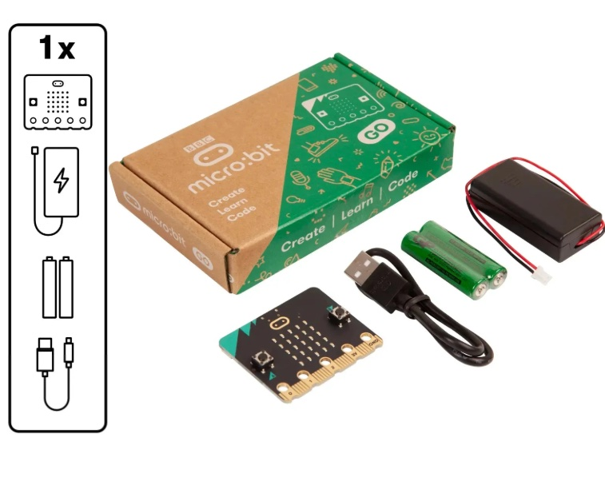

# Guide to micro:bit V2

**Ages:** about 10+ (younger with help)

**Goal:** Get the right gear, set up MakeCode, and start building physical-computing
projects on the BBC micro:bit V2.

The micro:bit is a tiny computer you can program to make games, wearables, robots, and
sensor projects. This guide helps you choose parts, plug in for the first time, and find
tutorials that match your level.

*Disclaimer: There is no affiliation with Amazon; product links are for convenience
only.*

______________________________________________________________________

## 1. Getting your gear

Start with the **micro:bit V2 Go Bundle** — it includes the board, a USB cable, and a
battery pack.

| Item                                  | What it does                                                      | Where to find it                                                                                                                                                                                               |
| ------------------------------------- | ----------------------------------------------------------------- | -------------------------------------------------------------------------------------------------------------------------------------------------------------------------------------------------------------- |
| **micro:bit V2 Go Bundle**            | The “brain” of your project, with built-in sensors and a speaker. | [Official micro:bit Store](https://microbit.org/buy/), [Micro:bit V2 bundle on Amazon](https://www.amazon.com/dp/B0BJ4HQ63P?ref=ppx_yo2ov_dt_b_fed_asin_title)                                                 |
| **Sensor expansion board**            | Makes it easier to plug in extra sensors without fiddly wiring.   | [Keyestudio KS0360](https://www.keyestudio.com/products/keyestudio-micro-bit-sensor-shield-v2-black-and-eco-friendly), [Buy on Amazon](https://www.amazon.com/dp/B07H9X63CR?ref=ppx_yo2ov_dt_b_fed_asin_title) |
| **Electronic components starter kit** | Breadboard parts — resistors, LEDs, jumper wires, and more.       | [Electronic Starter Kit](https://www.amazon.com/gp/product/B099MQV8ZW/ref=ox_sc_act_title_1?smid=A2RFXKS6GNXFWP&psc=1)                                                                                         |

*Budget note: the items in this section usually total about US $50–60.*

### Sensor shield details

The Keyestudio Sensor Shield V2 (KS0360) gives your micro:bit a clearer pin layout for
sensors and modules.

1. Documentation:
   [Keyestudio Sensor Shield V2 for BBC micro:bit](https://docs.keyestudio.com/projects/KS0360/en/latest/docs/Keyestudio%20Sensor%20Shield%20V2%20for%20BBC%20microbit.html)
2. Product page:
   [Keyestudio KS0360](https://www.keyestudio.com/products/keyestudio-micro-bit-sensor-shield-v2-black-and-eco-friendly)

______________________________________________________________________

## 2. Micro:bit vs. Arduino

The **micro:bit** is beginner-friendly: LED matrix, buttons, sensors, and a speaker are
already on the board. You can learn quickly with almost no extra wiring.

**Arduino** is a versatile platform for more complex electronics. It often needs more
setup and external parts to match what the micro:bit includes out of the box. Many
learners treat Arduino as a strong **next step** after micro:bit projects feel
comfortable.

______________________________________________________________________

## 3. Extra electronic components

For bigger builds (robots, motors, custom sensors — including projects like a
“Bat-Bot”-style ultrasonic robot), you will want discrete parts beyond the Go Bundle.

If you are new to breadboards, resistors, and transistors, complete
[Beginner Circuits](../02-circuits/beginner.md) first — then come back here for
micro:bit projects that mix board + wiring.

- **Transistors:** [Buy on Amazon](https://www.amazon.com/dp/B0C1V6Y8ND)
- **Resistors:** [Buy on Amazon](https://www.amazon.com/dp/B0BYZB6J23)
- **Diodes:** [Buy on Amazon](https://www.amazon.com/dp/B07T61SY9Y)
- **Ultrasonic sensor:** Helps a robot “see” distance.
  [Buy on Amazon](https://www.amazon.com/dp/B0GL8NJCVT)
- **Vibration motors:** Haptic buzz / feedback.
  [Buy on Amazon](https://www.amazon.com/dp/B07Q1ZV4MJ)
- **Breadboard:** [Buy on Amazon](https://www.amazon.com/dp/B08Y59P6D1)
- **9V battery adapters:** [Buy on Amazon](https://www.amazon.com/dp/B088FBS263)

______________________________________________________________________

## 4. Setting up your lab

Program the micro:bit with **Microsoft MakeCode**. It uses colorful blocks — very
similar to [Scratch](https://scratch.mit.edu/) — that snap together so typing mistakes
do not block you.

If you want more Scratch practice first, use the
[Learning Scratch Programming](../01-scratch/scratch-programming.md) guide.

You can also switch to **Python** or **JavaScript** in MakeCode when you are ready for
text.

1. Go to [makecode.microbit.org](https://makecode.microbit.org).
2. Click **New Project**.
3. Connect your micro:bit to the computer with the USB cable.
4. Download your program to the board and try the on-board LEDs or buttons.

______________________________________________________________________

## 5. Video tutorials and project ideas

Learning by watching — then rebuilding — is one of the fastest ways to improve. Work top
to bottom, or jump to a topic you need.

### Basics of electronic parts

These videos overlap with ideas in [Beginner Circuits](../02-circuits/beginner.md). Use
them as a refresher, or watch before wiring sensors to the micro:bit.

- [How to Use a Breadboard](https://www.youtube.com/watch?v=6WReFkfrUIk)
- [Basic Electronics for Beginners in 15 Steps](https://www.youtube.com/watch?v=a9VxTE3-bbA)
- [If You Understand This, You Understand Electronics](https://www.youtube.com/watch?v=I-C0zWTTiAk)
- [How Resistor Work - Unravel the Mysteries of How Resistors Work!](https://www.youtube.com/watch?v=DYcLFHgVCn0)
- [Fun with Transistors](https://www.youtube.com/watch?v=5vRAACeebjI)

### Micro:bit V2 tutorials

- Introduction to micro:bit V2
  - [Get to know the BBC micro:bit's features](https://www.youtube.com/watch?v=7WMCgUIcKnk)
- [How to use a micro:bit | Tutorial #1](https://www.youtube.com/watch?v=ItcTxWW3c5Q)
- [How to use buttons on a micro:bit | Tutorial #2](https://www.youtube.com/watch?v=SH3M1WZs7FM)
- [If/else statements with micro:bit | Tutorial #3](https://www.youtube.com/watch?v=Ocx7H4e6Geg)
- [Motion control with micro:bit | Tutorial #4](https://www.youtube.com/watch?v=KMzc3NE9FcI)
- [Coding with micro:bit - Part 3A - LED lighting](https://www.youtube.com/watch?v=gnSRkUxBV18)
- [Coding with micro:bit - Part 4 - Making Music](https://www.youtube.com/watch?v=6hxvLZSM_pM&list=PLmqeu38gRdJVCMUhgmF8OrjOhYpYtoh9U&index=5&pp=iAQB)
- [Coding with micro:bit - Part 5 - Motors & Servos](https://www.youtube.com/watch?v=BDMm0C94wEw&list=PLmqeu38gRdJVCMUhgmF8OrjOhYpYtoh9U&index=6)
- [Coding with micro:bit - Part 6 - Coding tips - Variables and Conditionals](https://www.youtube.com/watch?v=Z_Gy8yEhq2Q&list=PLmqeu38gRdJVCMUhgmF8OrjOhYpYtoh9U&index=7&pp=iAQB)
- [Coding with micro:bit - Part 7 - Making a Virtual Pet](https://www.youtube.com/watch?v=zc3njwmP_O8&list=PLmqeu38gRdJVCMUhgmF8OrjOhYpYtoh9U&index=8&pp=iAQB)
- [Coding with micro:bit - Part 8 - Making a servo powered waving arm and inch worm](https://www.youtube.com/watch?v=e1H0e6un7DY&list=PLmqeu38gRdJVCMUhgmF8OrjOhYpYtoh9U&index=9&pp=iAQB)
- [Control rotation and speed with Micro:bit](https://www.youtube.com/watch?v=be-MBFKH8YU)
- **Full series start:**
  [Coding with micro:bit - Part 1 - Introduction](https://www.youtube.com/watch?v=hr8O_pslp8Q&list=PLmqeu38gRdJVCMUhgmF8OrjOhYpYtoh9U)

### Projects

- [Play Scratch Games with microbit #stemeducation](https://youtu.be/gOJYHuA5zjY?is=QVtxDJMvOsdBJR43)
- [Blink LED Using Microbit](https://www.youtube.com/watch?v=H-l5r3MaeRg)
- [3 Flashing LED Lights on a Micro:bit](https://www.youtube.com/watch?v=_iMb73owhso)
- [Micro:bit Solar Tracker | Science Project](https://www.youtube.com/watch?v=oPuld-ki4lw)

______________________________________________________________________

## 6. Other starter kits

Robot and sensor kits can speed up learning if you want a packaged set of parts:

- [KEYESTUDIO Sensors Box Starter Kit for Micro:bit](https://www.amazon.com/KEYESTUDIO-Sensors-Box-Starter-Micro/dp/B07GSVHWNS)
- [KEYESTUDIO Micro:bit V2 Robot Starter Kit (without Microbit) for Makecode and Python](https://www.amazon.com/KEYESTUDIO-Micro-Starter-Microbit-Makecode/dp/B0BY43BB3F/ref=pd_cart_d_dex_com_cart_typ_t1_d_sccl_1_4/130-8640794-0706344?pd_rd_w=Atu9Z&content-id=amzn1.sym.3e6f2a7a-acc0-4c3e-99de-7fc144f51128&pf_rd_p=3e6f2a7a-acc0-4c3e-99de-7fc144f51128&pf_rd_r=RX13CEEVRXPDFRKZHW7Y&pd_rd_wg=1UrhC&pd_rd_r=76655f8f-7e3a-4138-820e-3545348e891d&pd_rd_i=B0BY43BB3F&psc=1)

______________________________________________________________________

## What’s next

- New to electronics wiring? → [Beginner Circuits](../02-circuits/beginner.md)
- Want stronger block-coding habits? →
  [Learning Scratch Programming](../01-scratch/scratch-programming.md)
- Ready to invent? Combine MakeCode with sensors, motors, and the expansion board — then
  share what you build.
