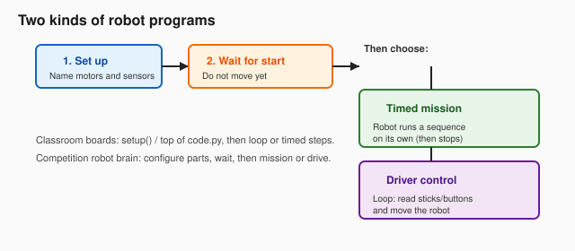
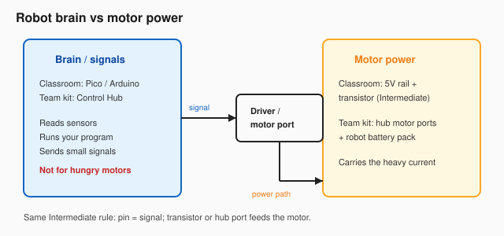
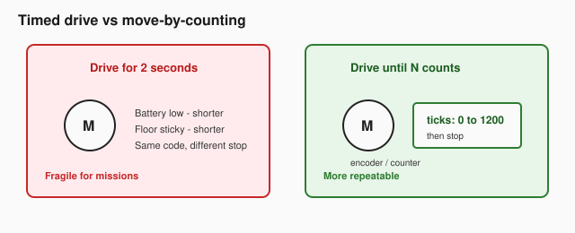

# Robot Missions

**Ages:** about 12+ (younger with a mentor)

**Prerequisites (required):**

- [Beginner Circuits](../03-circuits/beginner.md)
- [Intermediate Circuits](../03-circuits/intermediate.md)
- [CircuitPython](../05-circuitpython/circuitpython.md) **or**
  [Arduino](../06-arduino/arduino.md)

**Helpful first:** the [micro:bit V2 guide](../04-microbit/microbit-v2.md) (sensors +
outputs with blocks).

**Goal:** Build the habits real robot teams use — timed missions, driver control, named
parts, safe motors, and move-by-counting — on a classroom board, and on a competition
robot brain when your group has one.

______________________________________________________________________

## You’re building mission robots

A mission robot needs two kinds of programs:

1. **Timed mission** — the robot runs a sequence on its own (drive, stop, move an arm).
2. **Driver control** — a person steers with sticks or buttons while a loop reads the
   controls and moves motors.

You already practiced loops, sensors, and transistor motor drivers. This module connects
those ideas into **robot programs** with a clear start sequence.



______________________________________________________________________

## Two ways to practice

| Path                  | What you use                                                             | When                                                         |
| --------------------- | ------------------------------------------------------------------------ | ------------------------------------------------------------ |
| **Classroom board**   | Pico (CircuitPython) or Arduino Uno + your Circuits kit                  | Always available; finish every lab this way if needed        |
| **Competition brain** | REV Control Hub (or Expansion Hub), robot battery, motors/servos/sensors | When your team or club has the kit — same labs, hub software |

You can complete the whole module on a classroom board. The competition-brain steps are
the same missions with hub motor ports and Blocks (then a little typed code).

______________________________________________________________________

## What you need

### Classroom board (Practice path)

Reuse gear from earlier modules:

- Pico with CircuitPython **or** Arduino Uno
- Breadboard, jumpers, 5V power module, 9V battery + adapter
- Push button, potentiometer, LED + 220Ω
- Small DC motor, NPN transistor, 1kΩ base resistor, flyback diode (Intermediate Circuit
  4\)
- Optional: photoresistor; hobby servo if you have one

### Competition brain (Team kit path)

Short list (mentor / team kit):

- REV Control Hub (or Expansion Hub + compatible phone / Driver Station setup)
- Charged robot battery and safe charging habits
- 1–2 DC motors (encoders preferred for Lab E)
- 1 servo
- 1 touch sensor or color sensor
- USB cable / Wi‑Fi as your hub docs require

Follow the current Control Hub getting-started docs from REV for Driver Station pairing
and Blocks. Do not invent a second wiring standard here.

______________________________________________________________________

## Mission 0: Robot lab rules

Everything from Intermediate Maker Rules still applies. Add these:

1. **Brain ≠ motor power.** A GPIO pin or logic signal must not feed a hungry motor.
   Classroom path: transistor + flyback diode. Team kit: hub **motor ports** and the
   robot battery.
2. **Strong batteries deserve respect.** Power off before rewiring. No bare metal across
   battery terminals. Mentors handle first-time battery / hub setup.
3. **Name every part before you code.** Write a parts list: `left_motor`, `arm_servo`,
   `bumper` — then wire and configure those names.
4. **Wait for start.** Missions should set up quietly, then move only after a clear
   start signal (button, mentor “go,” or hub wait-for-start).



______________________________________________________________________

## Lab A: Two kinds of programs

**The Goal:** Feel the difference between a timed mission and a driver-control loop.

### Practice path (classroom board)

**Parts:** Board + 1× LED + 220Ω (and optionally a button).

1. **Timed mission:** Turn the LED on for 1 second, off for 1 second, repeat exactly
   three times, then stop (exit the loop or sit idle).
2. **Driver control:** In a forever loop, turn the LED on only while a button is held
   (or toggle with two keys in the Serial monitor if you prefer).

CircuitPython-shaped timed mission:

```python
import time
import board
import digitalio

led = digitalio.DigitalInOut(board.LED)
led.direction = digitalio.Direction.OUTPUT

# Set up done — wait for a mentor "go", then run the mission
input("Press Enter to start the mission...")

for _ in range(3):
    led.value = True
    time.sleep(1)
    led.value = False
    time.sleep(1)

# Mission finished — do not keep blinking
while True:
    time.sleep(1)
```

Arduino-shaped driver control uses `loop()` to read a button and `digitalWrite` the LED
— same idea as Scratch `forever` + `if`.

### Team kit path

1. Create a **Blocks** program on the Control Hub.
2. In setup / init: configure nothing that moves yet (or set motor power to 0).
3. Use **wait for start**.
4. Timed mission: run a motor slowly for 1 second, stop, done.
5. Second program: driver control — forever loop reading a gamepad button to run/stop a
   motor.

#### The Discovery

**What happened?** The timed mission does the same thing every run. Driver control waits
on you.

**You built it!** You learned: set up → wait for start → mission **or** drive loop.

______________________________________________________________________

## Lab B: One motor + one sensor

**The Goal:** Motor moves only when a sensor says so — named parts, safe drive.

### Practice path

Reuse
[Intermediate Circuit 4](../03-circuits/intermediate.md#circuit-4-motor--flyback-diode)
(motor + transistor + flyback diode). Drive the transistor base from a board pin through
the base resistor. Use a push button (or LDR + threshold) as the sensor.

**Parts list example:** `drive_motor`, `bumper` (button).

Behavior: while bumper is pressed, motor runs slowly; release → stop. Never connect the
motor straight to a pin.

### Team kit path

1. Plug a DC motor into a hub motor port. Plug a touch (or color) sensor into a sensor
   port.
2. In Blocks (or Device config): name them `drive_motor` and `bumper`.
3. After wait-for-start: while `bumper` is pressed, set `drive_motor` to a low power;
   otherwise 0.

#### Typed team code bridge (same robot)

When Blocks feels easy, remake **only this lab** in typed hub code. The shape looks
like:

```java
// Names must match your robot configuration
DcMotor driveMotor;
DigitalChannel bumper;

@Override
public void init() {
    driveMotor = hardwareMap.get(DcMotor.class, "drive_motor");
    bumper = hardwareMap.get(DigitalChannel.class, "bumper");
    bumper.setMode(DigitalChannel.Mode.INPUT);
}

@Override
public void loop() {
    if (bumper.getState()) {
        driveMotor.setPower(0.3);
    } else {
        driveMotor.setPower(0);
    }
}
```

Your mentor’s sample OpMode template may use slightly different base classes — match
their template; keep the **parts list → hardwareMap → loop** idea.

#### The Discovery

**What happened?** The sensor gates the motor. Names in code match names on the robot.

**You built it!** You learned: named parts list + safe motor drive + sensor gate.

______________________________________________________________________

## Lab C: Arm positions (servo)

**The Goal:** Move an “arm” to three clear positions.

### Practice path

- **If you have a hobby servo:** follow a Pico/Arduino servo tutorial; send three angles
  (for example 0° / 90° / 180°) with pauses. Use a separate 5V supply for the servo if
  the board brown-outs; **tie GNDs together**.
- **If you do not:** simulate positions with an LED brightness or three blink patterns
  named `STOW`, `REACH`, `DROP`. The idea is **named states**, not the plastic horn.

### Team kit path

Configure a servo as `arm_servo`. After start: move to three positions with short
pauses. Add a challenge: button or gamepad bumper selects the next position.

#### The Discovery

**What happened?** Positions are easier to reason about than “spin for a bit.”

**You built it!** You learned: discrete arm states for missions.

______________________________________________________________________

## Lab D: Driver station thinking

**The Goal:** Map controls to robot actions — a mini driver station.

### Practice path

**Parts:** Potentiometer and/or two buttons + motor driver from Lab B (or LED if you are
still warming up).

| Control          | Robot action                         |
| ---------------- | ------------------------------------ |
| Pot left / right | Motor reverse / forward (or LED dim) |
| Button A         | Arm to REACH (or LED pattern B)      |
| Button B         | Arm to STOW (or LED pattern A)       |

Read controls inside a forever loop. Print values to Serial / Mu so you can debug.

### Team kit path

Map gamepad left stick Y to `drive_motor` power (start with a low max). Map A/B buttons
to two servo positions. Deadband: ignore tiny stick noise near center.

#### The Discovery

**Experiment:** Swap which button does REACH vs STOW. Can a partner drive without you
explaining?

**You built it!** You learned: control map + loop + deadband thinking.

______________________________________________________________________

## Lab E: Move by counting

**The Goal:** See why timed drive is fragile — then use counters when you have them.



### Practice path

1. Timed drive: run the motor for 2 seconds. Mark how far it went on the table (tape).
2. Change nothing in code. Repeat with a weaker battery, a finger drag on the shaft, or
   a slight uphill tilt (mentor-safe). Distance changes.
3. **Concept:** time ≠ distance when load or voltage changes.

Classroom boards often lack wheel encoders. That is OK — the lesson is the failure mode.
If you later get an encoder motor, count ticks instead of seconds.

### Team kit path

1. Use a motor with an encoder. Reset the counter, run to a target tick count at low
   power, then stop.
2. Challenge: run forward N ticks, then reverse to the start count.
3. Skip PID for now — low power and a generous stop window are enough.

#### The Discovery

**What happened?** Counts aim at the same place more often than a blind timer.

**You built it!** You learned: missions prefer measuring motion, not only sleeping.

______________________________________________________________________

## Scratch / MakeCode / Python → robot program map

| Idea you already know                         | Robot mission habit                 |
| --------------------------------------------- | ----------------------------------- |
| `when green flag clicked`                     | Set up / init, then wait for start  |
| `forever`                                     | Driver-control loop                 |
| Timed list of steps                           | Timed mission sequence              |
| Sprite / variable names                       | Named motors, servos, sensors       |
| `if <sensor>`                                 | Gate motors and mission branches    |
| Custom blocks / functions                     | Reuse “drive forward,” “arm reach”  |
| CircuitPython `while True` / Arduino `loop()` | Driver control on a classroom board |

______________________________________________________________________

## Mission ready checklist

Before you call this module done:

- [ ] I can explain brain/signals vs motor power
- [ ] I can describe set up → wait for start → timed mission **or** driver loop
- [ ] I keep a **named parts list** before coding
- [ ] I drove a motor safely (transistor path or hub motor port)
- [ ] I used a sensor to change robot behavior
- [ ] I moved an arm (servo or named LED states)
- [ ] I mapped controls to actions (pot/buttons or gamepad)
- [ ] I can explain why timed drive is fragile
- [ ] I wrote a short **build log**: what we tried, what broke, what we changed

______________________________________________________________________

## What’s next

1. **Invent:** a 30-second timed mission (three steps) **and** a driver mode for the
   same robot parts.
2. **Share** your parts list and build log with a mentor or teammates.
3. Revisit [Intermediate Circuits](../03-circuits/intermediate.md) if motor wiring feels
   shaky, or [CircuitPython](../05-circuitpython/circuitpython.md) /
   [Arduino](../06-arduino/arduino.md) for more text practice.

Mentors: see [`docs/robot-missions-coach.md`](../../docs/robot-missions-coach.md) for a
skills map, meeting sequence, and hub doc links.
